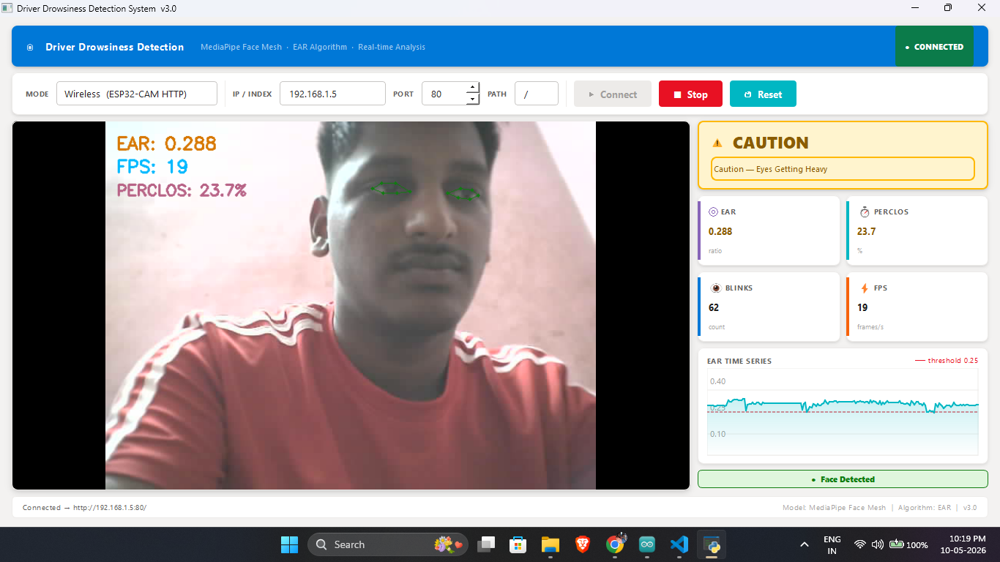

# 🚗 Driver Drowsiness Detection System

> Real-time AI driver monitoring using **MediaPipe Face Mesh** + **Eye Aspect Ratio (EAR)** algorithm with a **PyQt5** dashboard. Supports both **ESP32-CAM** (wireless) and **USB cameras** (wired).


---

## 📸 Screenshots



---

## ✨ Features

| Feature | Details |
|---|---|
| **Detection Algorithm** | Eye Aspect Ratio (EAR) via MediaPipe Face Mesh 468-landmark model |
| **Alert Levels** | 4 levels: ALERT → CAUTION → DROWSY → DANGER |
| **PERCLOS Metric** | % of eye-closed frames in a rolling 300-frame window |
| **Blink Counter** | Counts natural blink events in real time |
| **EAR Graph** | Live scrolling graph with threshold line |
| **Camera Support** | ESP32-CAM wireless MJPEG *and* USB cameras |
| **Port Selection** | Configurable IP, port, and URL path |
| **Threading** | Capture runs in a dedicated QThread — UI never freezes |
| **Dashboard UI** | Dark data-centric PyQt5 dashboard |

---

## 🧠 Detection Algorithm

### Eye Aspect Ratio (EAR)

The EAR is computed per frame using six eye landmarks provided by MediaPipe Face Mesh:

```
       P2    P3
  P1            P4
       P6    P5
```

```
EAR = (||P2 - P6|| + ||P3 - P5||) / (2 × ||P1 - P4||)
```

| Metric | Threshold | Meaning |
|---|---|---|
| EAR | > 0.30 | Eyes fully open |
| EAR | < 0.25 | Eye considered *closed* |
| Closed duration | ≥ 2 s | **DROWSY** alert |
| Closed duration | ≥ 4 s | **DANGER** alert |
| PERCLOS | > 35 % | Drowsy |
| PERCLOS | > 65 % | Danger |

**Reference:** Soukupová & Čech (2016) — *Real-Time Eye Blink Detection using Facial Landmarks*

### Why MediaPipe over YOLO?

| Approach | Accuracy | Speed | Drawback |
|---|---|---|---|
| Generic YOLOv8 (original) | ❌ No eye data | Fast | Cannot measure eye openness |
| Dlib 68-pt landmarks | ✅ Good | Slow on CPU | Large model, complex install |
| **MediaPipe Face Mesh** | ✅ 468 landmarks | ✅ Real-time | Requires lighting |
| Custom CNN (EyeNet) | ✅ Best | Medium | Needs training data |

---

## 🛠️ Hardware Requirements

### Option A — Wireless (ESP32-CAM)
- **AI-Thinker ESP32-CAM** board
- FTDI USB-to-TTL programmer (for uploading firmware)
- 5 V / 2 A power supply
- Same WiFi network as the PC running the app

### Option B — Wired (USB Camera)
- Any USB webcam (720p or higher recommended)
- Windows / Linux / macOS

---

## 📦 Software Setup

### 1 — Clone the repository

```bash
git clone https://github.com/your-username/drowsiness-detection.git
cd drowsiness-detection
```

### 2 — Create a virtual environment (recommended)

```bash
python -m venv venv

# Windows
venv\Scripts\activate

# Linux / macOS
source venv/bin/activate
```

### 3 — Install Python dependencies

```bash
pip install -r requirements.txt
```

> **Note:** MediaPipe downloads its face mesh model (~5 MB) automatically on first run.

### 4 — Run the application

```bash
python app.py
```

---

## 🔧 ESP32-CAM Firmware Setup

### Install Arduino IDE + ESP32 board package

1. Open **Arduino IDE** → Preferences → Additional Boards Manager URLs:
   ```
   https://raw.githubusercontent.com/espressif/arduino-esp32/gh-pages/package_esp32_index.json
   ```
2. Tools → Board Manager → search **esp32** → Install `esp32 by Espressif Systems`

### Configure firmware

Open `drowsiness_detection_system.ino` and update:

```cpp
#define WIFI_SSID     "YOUR_WIFI_SSID"
#define WIFI_PASSWORD "YOUR_WIFI_PASSWORD"
```

Optionally adjust resolution/quality:

```cpp
#define FRAME_SIZE   FRAMESIZE_VGA   // 640×480 (~25 fps)
#define JPEG_QUALITY 12              // 0–63 (lower = better quality)
```

### Board settings

| Setting | Value |
|---|---|
| Board | `AI Thinker ESP32-CAM` |
| Upload Speed | `115200` |
| CPU Frequency | `240 MHz (WiFi/BT)` |
| Flash Mode | `DIO` |
| Partition Scheme | `Huge APP (3MB No OTA)` |

### Wiring (FTDI programmer)

```
ESP32-CAM  →  FTDI
───────────────────
5V         →  5V
GND        →  GND
U0R (RX)   →  TX
U0T (TX)   →  RX
IO0        →  GND   (only during upload, remove after)
```

### Upload steps

1. Connect IO0 to GND
2. Click **Upload** in Arduino IDE
3. Once *Connecting...* appears → press **RST** button on ESP32-CAM
4. After upload: disconnect IO0 from GND → press RST again
5. Open Serial Monitor at **115200 baud** → note the IP address

### Connect in the app

- Mode: **Wireless (ESP32-CAM)**
- IP: `192.168.1.x` (as shown in Serial Monitor)
- Port: `80`
- Path: `/`  (or `/stream`)
- Click **▶ CONNECT**

---

## 🖥️ Wired USB Camera Usage

- Mode: **Wired (USB Camera)**
- Index: `0` (default camera), `1`, `2` … for additional cameras
- Click **▶ CONNECT**

---

## 📁 Project Structure

```
drowsiness-detection/
├── app.py                          # Main PyQt5 application
├── drowsiness_detection_system.ino # ESP32-CAM firmware
├── requirements.txt                # Python dependencies
└── README.md                       # This file
```

---

## ⚙️ Configuration Reference

### EAR thresholds (`app.py`)

```python
EAR_THRESHOLD     = 0.25   # Eye closed threshold
EAR_CAUTION_DELTA = 0.05   # Caution zone above threshold
DROWSY_SECONDS    = 2.0    # Seconds → DROWSY alert
DANGER_SECONDS    = 4.0    # Seconds → DANGER alert
PERCLOS_WINDOW    = 300    # Frame window for PERCLOS
```

Adjust `EAR_THRESHOLD` if detection is too sensitive (increase) or misses closures (decrease). Typical range: **0.20 – 0.28**.

---

## 🚀 Performance Tips

| Tip | Effect |
|---|---|
| Use PSRAM-enabled ESP32-CAM | Enables dual frame buffer → higher FPS |
| Set `FRAMESIZE_QVGA` on ESP32-CAM | Up to ~30+ fps over WiFi |
| Use 5 GHz WiFi | Lower latency |
| Ensure good front lighting | Improves MediaPipe detection confidence |
| Close other camera apps | Prevents USB camera conflicts |

---

## 🐛 Troubleshooting

| Problem | Solution |
|---|---|
| "No signal" / can't connect | Check IP in Serial Monitor; ensure same WiFi |
| Face not detected | Improve lighting; face the camera directly |
| Very high PERCLOS (false positives) | Increase `EAR_THRESHOLD` to 0.27–0.28 |
| Low FPS | Reduce ESP32 frame size; close other apps |
| Camera index not found | Try index 1, 2 instead of 0 |
| MediaPipe import error | `pip install mediapipe --upgrade` |
| ESP32 upload fails | Check IO0→GND wiring; press RST at *Connecting...* |

---

## 📄 License

MIT License — see [LICENSE](LICENSE) for details.

---

## 🙏 References

- Soukupová, T. & Čech, J. (2016). Real-Time Eye Blink Detection using Facial Landmarks. *CVWW 2016*.
- [MediaPipe Face Mesh](https://google.github.io/mediapipe/solutions/face_mesh.html) — Google
- [PERCLOS Standard](https://rosap.ntl.bts.gov/view/dot/1208) — NHTSA Technical Report

---

*Made with ❤️ for road safety*
